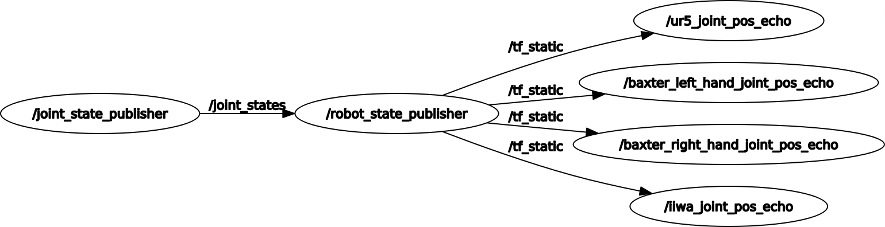

### 多机器人关节笛卡尔空间位置获取小任务
--------------------
_language:中文_

#### Dependence
---------
1. universal_robot 功能包
2. iiwa_stack 功能包
3. Baxter 功能包(似乎存在版本问题)

#### Usage

---------------

分别在两个终端窗口中输入

```Bash
roslaunch multi_robot ur5_iiwa_baxter_display.launch
```

```bash
roslaunch multi_robot joint_pos_echo.launch
```

获取机器人关节xyz

```bash
rostopic echo /ur_pos
```

除/ur_pos外有：/iiwa_pos,/baxter_left_hand_pos,/baxter_right_hand_pos

 

发送关节角到rviz中让机器人运动

```bash
rosrun multi_robot ur_joint_pos_pub.py 0 0 0 0 0 0
```

```bash
rosrun multi_robot iiwa_joint_pos_pub.py 0 0 0 0 0 0 0
```

```bash
rosrun multi_robot baxter_left_hand_joint_pos_pub.py 0 0 0 0 0 0 0
```

```bash
rosrun multi_robot baxter_right_hand_joint_pos_pub.py 0 0 0 0 0 0 0
```

上面四个四个可执行文件分别对应与ur，iiwa，baxter_left_hand，baxter_right_hand的关节设置

_注:若RVIZ中出现机器人闪动，请运行下面的指令_

```bash
rosnode kill /joint_state_publisher
```


#### Log

------
目前已经完成多个机器人关节空间的输出任务

节点图如下：


